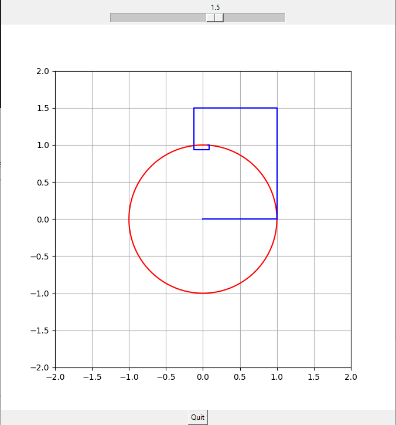

# manifold control

This is a repository to learn about geometric control theory. Therer are some tools on how to implement contorl strategies for different topologies and visualizing different concepts.

### Exponential map:

If you run the script, you shoul see a this GUI that shows how exponential map works for a circle and its tangent space at (1,0):

